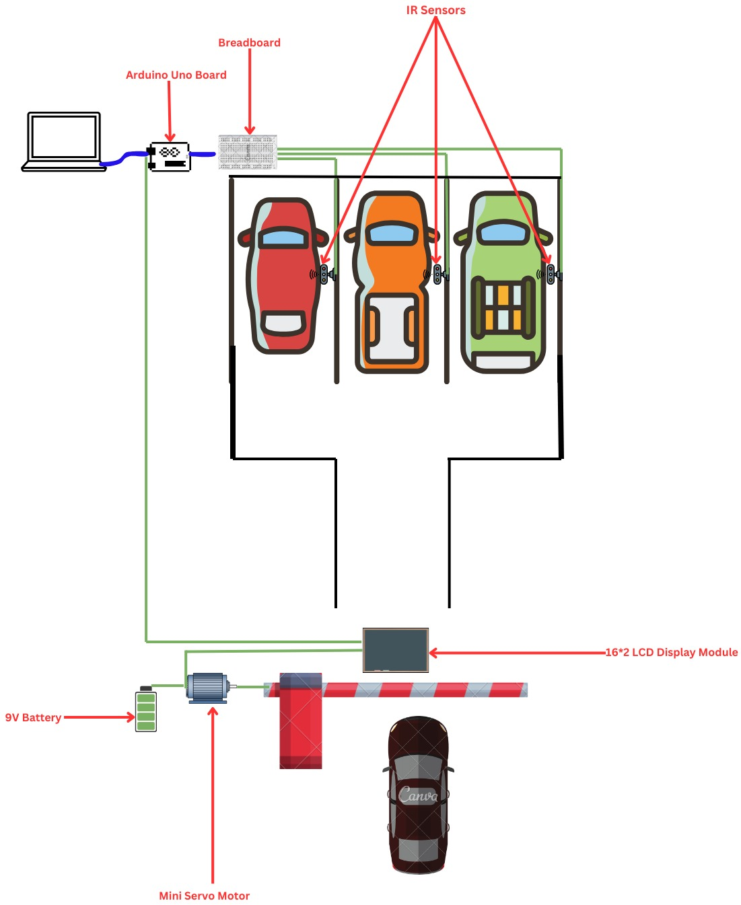
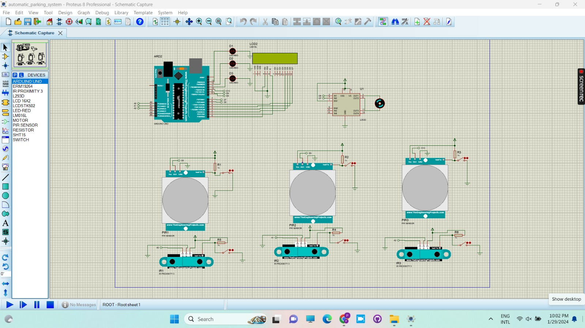

🚗 Smart Car Park System

📖 Overview

In today’s busy lifestyle, vehicle damage in public parking causes significant financial strain, especially in developing countries like Sri Lanka. Unlike advanced vehicles in developed nations with accident-detecting sensors, most drivers here face challenges due to a lack of safety measures.

To address this, we propose a Smart Car Park system that uses Arduino-based technologies and distance-measuring sensors to:

Prevent collisions during parking.

Automatically open and close gates.

Display real-time parking availability (Full / Available).

🎯 Objectives

Improve efficiency and enhance the parking experience.

Display available slots on a digital LCD screen.

Trigger alarms if vehicles are too close or not parked correctly.

Integrate sensors with gate control for automated entry and exit.

Ensure safety, reliability, and ease of use.

🛠 Requirements
Functional Requirements

Powered by Arduino Mega to control the system.

LCD display shows number of available slots.

Gate automatically opens and closes when a vehicle enters.

Collision detection via sensors.

Non-Functional Requirements

User-friendly

Efficient & Reliable

Scalable & Maintainable

High availability

System Requirements

Software:

Arduino IDE

Proteus 8 (for simulation)

Hardware:

Arduino Mega / Uno

IR Sensors

16x2 LCD Display

Servo Motor

Motor Driver IC (L293D)

Buzzer

Battery (9V / external supply)

Jumper wires, Breadboard

Languages:

C / C++

Frameworks/Technologies:

Arduino-based embedded technologies

PCB design with EasyEDA

🔄 Methodology (RAD Model)

Requirement Planning: Identify user problems in public parking.

User Design: Build prototype of safe parking system with sensors.

Construction: Testing with drivers, improving reliability and usability.

Cutover: Deploy system, provide maintenance, and monitor performance.

📊 Workflow

Vehicle arrives at parking entrance.

System checks slot availability.

If slot available → Gate opens automatically → closes after entry.

LCD display shows updated available slots.

Collision detection system activates light/buzzer if cars are too close.

If full → Gate remains closed → LCD displays “Parking Full”.

🖼 Technical Diagrams

Concept Design

Simulation Diagram (Proteus)

⚙️ Hardware Selection

Microcontroller: Arduino Mega 2560

Modules/Sensors: IR sensors, LCD Display, Motor driver IC, Servo Motor, Buzzer

Energy Source: External battery supply
